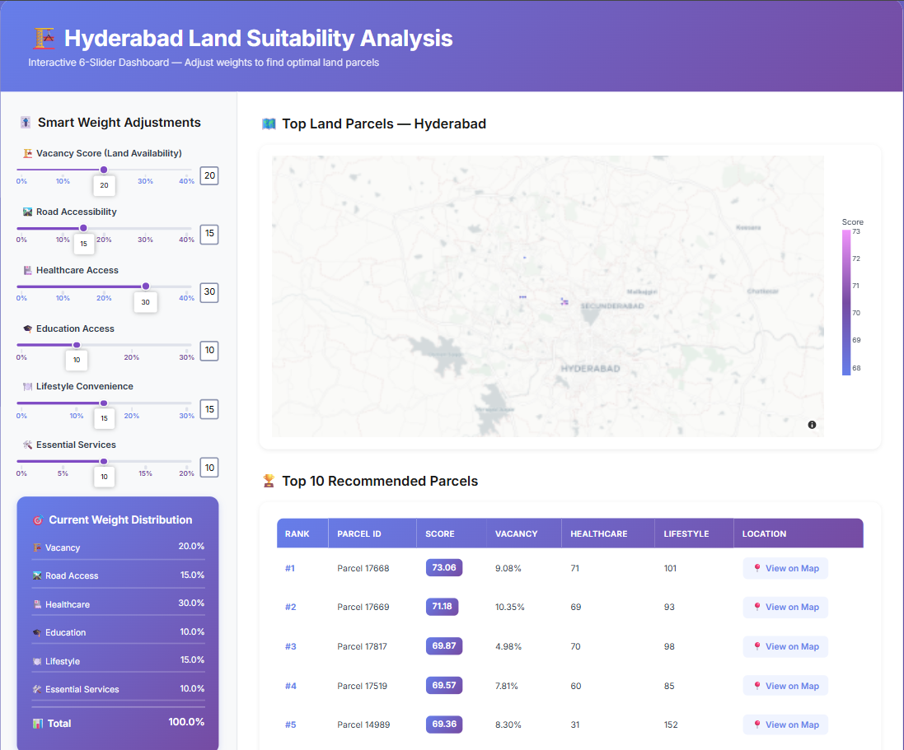
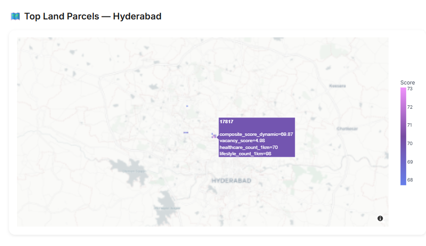
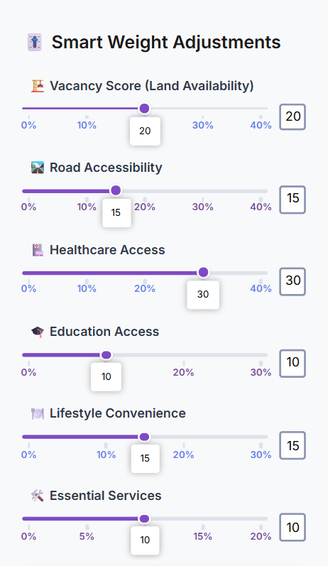
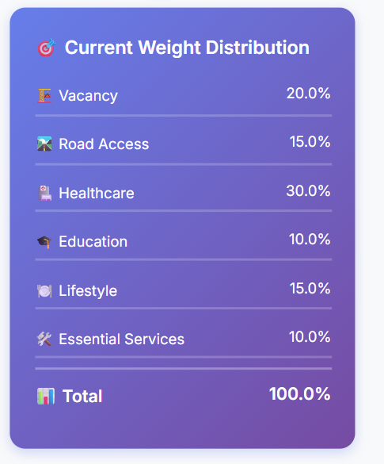
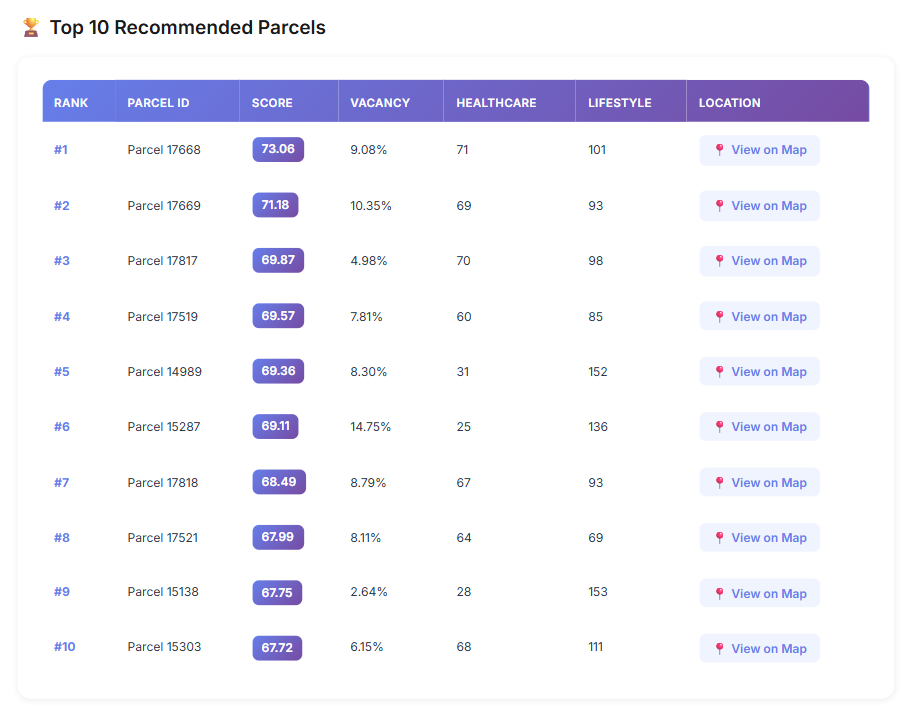

# 🏗️ Acre Vision – Hyderabad Land Suitability Analysis


An interactive geospatial decision-support dashboard that helps identify the most suitable land parcels for development in Hyderabad using multi-criteria land suitability analysis.

Users can dynamically adjust the importance of different development factors and instantly visualize how parcel rankings change across the city.

---

## 🌐 Live Demo

🔗 https://acre-vision.onrender.com

---

## 📸 Screenshots

### Dashboard Overview



### Interactive Suitability Map



### Adjustable Criteria Sliders



### Weight Distribution Summary



### Top 10 Recommended Parcels



---

## 🚀 Key Highlights

* Interactive land suitability analysis for Hyderabad
* Multi-criteria weighted scoring system
* Real-time parcel ranking based on user-defined priorities
* Geospatial visualization using Plotly Mapbox
* Decision-support tool for urban planning and real-estate development
* Responsive dashboard built using Dash
* Cloud deployment using Render

---

## 🌟 Features

### 🎚️ Interactive Weight Adjustment

Customize the importance of:

* Vacancy Score (Land Availability)
* Road Accessibility
* Healthcare Access
* Education Access
* Lifestyle Convenience
* Essential Services

The dashboard automatically normalizes weights and recalculates parcel rankings in real time.

### 🗺️ Interactive Parcel Visualization

* Mapbox-based geospatial visualization
* Color-coded suitability scores
* Interactive parcel exploration
* Parcel location links through Google Maps
* Real-time score updates

### 🏆 Smart Parcel Ranking

* Dynamic composite score calculation
* Top 10 recommended parcels
* Scenario-based land suitability analysis
* Data-driven decision support

---

## 🧠 Methodology

Each land parcel is evaluated using multiple criteria:

| Criterion             | Description                                    |
| --------------------- | ---------------------------------------------- |
| Vacancy Score         | Availability of land for development           |
| Road Accessibility    | Accessibility through transportation networks  |
| Healthcare Access     | Availability of healthcare facilities nearby   |
| Education Access      | Proximity to educational institutions          |
| Lifestyle Convenience | Access to restaurants, shopping, and amenities |
| Essential Services    | Availability of important public services      |

The final suitability score is calculated using a weighted scoring model:

```text
Composite Score =
Σ (Normalized Weight × Criterion Score)
```

Users can adjust criterion weights dynamically to perform scenario-based analysis and identify parcels best suited to their requirements.

---

## 🛠️ Technology Stack

### Frontend

* Dash
* Plotly
* HTML
* CSS

### Backend

* Python
* Pandas

### Visualization

* Plotly Express
* Mapbox

### Deployment

* Gunicorn
* Render

---

## 📂 Project Structure

```text
Acre_Vision/
│
├── Screenshots/
│   ├── Dashboard.png
│   ├── Map_With_Score.png
│   ├── Sliders.png
│   ├── Top_10_Results.png
│   └── Weight_Distribution.png
│
├── data/
│   └── 6slider_parcel_scores.csv
│
├── app.py
├── requirements.txt
├── render.yaml
├── LICENSE
└── README.md
```

---

## 📊 Dataset Requirements

The application expects a CSV dataset containing parcel-level information with fields such as:

```text
gid
latitude
longitude

vacancy_score
vacancy_subscore

road_subscore

healthcare_subscore
healthcare_count_1km

education_subscore

lifestyle_subscore
lifestyle_count_1km

essential_services_subscore

google_maps_link
```

---

## ⚙️ Installation

### Clone the Repository

```bash
git clone https://github.com/anuragv-10/Acre_Vision.git
cd Acre_Vision
```

### Install Dependencies

```bash
pip install -r requirements.txt
```

### Run the Application

```bash
python app.py
```


---

## 🚀 Deployment

This project is configured for deployment on Render.

The repository includes:

* render.yaml
* requirements.txt
* Gunicorn support

Deploy by connecting the GitHub repository to Render and creating a new Web Service.

---

## 🎯 Use Cases

* Urban Planning
* Smart City Development
* Land Suitability Analysis
* Real Estate Site Selection
* Infrastructure Planning
* Government Land Assessment
* Investment Decision Support

---

## 🔮 Future Enhancements

* Machine Learning-based suitability prediction
* Satellite imagery integration
* Environmental risk assessment
* Population density analytics
* Traffic and mobility analysis
* Multi-city support
* Automated recommendation engine

---

## 👥 Team Project

Acre Vision was developed as a collaborative team project focused on leveraging geospatial analytics and interactive visualization to support informed land development decisions.

---

